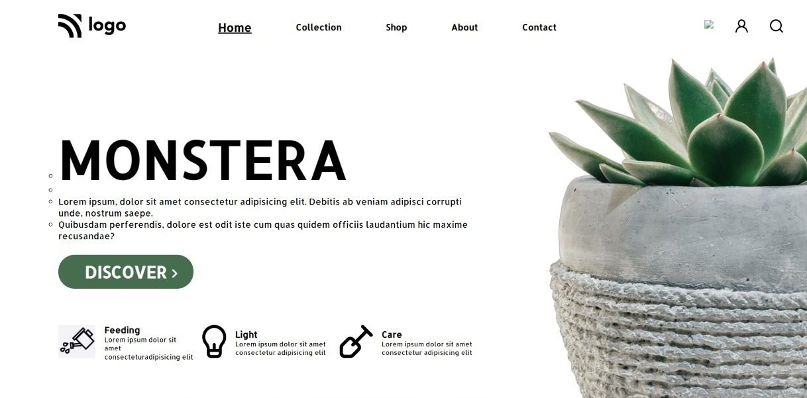

# Assignment-6 
## (Plant Home Page) 

> In this project, I have used HTML (the Hypertext Markup Language) and CSS (Cascading Style Sheets), which are two of the core technologies for building Web pages. It is a static and non-responsive page.

### As a result of this project, I learn the following:
[LIVE-LINK](https://projectplanthomepage.netlify.app/)

- [x] learned about how to use Font Awesome/icon
- [x] making perfect layout
- [x] position properties and google font

#### The duration of the project:2.30 hour